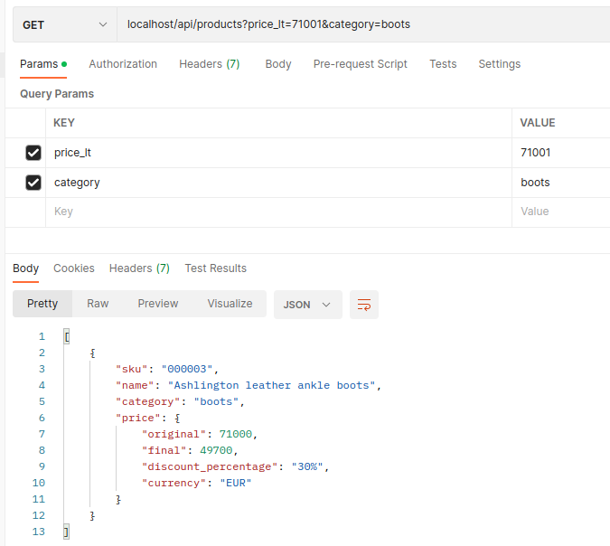

## Table of Contents
1. [General Info](#general-info)
2. [Technologies](#technologies)
3. [Prerequisites](#prerequisites)
4. [Installation](#Installation)
5. [Test](#Test)
6. [Observations](#Observations)
### General Info
***
Working code to pass the technical test "mytheresa Promotions Test" proposed by Capitole Consulting for the position of Backend Developer .
### Screenshot


## Technologies
***
I was thinking of using Golang to solve the tests because its configuration and deployment is simpler. I finally decided on Symfony because I have much more experience and background with this framework.
* [https://symfony.com/](https://symfony.com/)


## Prerequisites
***
The project will heard for request at port 80, please check no other software is using this port before run it.

The application is encapsulated using docker virtualization and uses Make to automate test launch and installation.

It is very possible that you already have these commands in your system, if not, I leave you some links for their installation in Ubuntu:

docker & docker-compose:
* [docker && docker-compose](https://www.digitalocean.com/community/tutorials/how-to-install-and-use-docker-compose-on-ubuntu-22-04)

Make:
```
sudo apt-get update
sudo apt-get -y install make
```

## Installation
***
To install the application run the following command:

```
git clone git@github.com:miguelvilata/mytheresa-promotions-test.git && cd mytheresa-promotions-test && make init
```

The above command will perform:
* clone the repo at local
* start containers
* initialize de project installing vendors, creating database and executing migrations.

After that the project should be running in your localhost.

Then you can try:

Get all products
```
curl --location --request GET 'localhost/api/products'
```

Get products from boots category
```
curl --location --request GET 'localhost/api/products?category=boots'
```

Get product from boots category with price < 71001
```
curl --location --request GET 'localhost/api/products?category=boots&price_lt=71001'
```

## Test
***

To execute the tests execute the followind command from project root folder:
```
make test
```

## Observations
***

I postpone some things in order to send the test faster. I made this decision because I think they don't add value in the context of the proof:

* I didn't create a separate bd for testing.
* I didn't configure documentation for the api using a bundle like Nelmio Api Doc


## Improvements
***

Because the nature of the test, It is a requirement calculate the rates when they are loading. An improvement to the test could be to save product with its final price and recalculate it only when necessary. This could help simplify
  the product list processes, without the need to inject PriceCalculator and allowing a better separation for the view model. 

This:
```
        foreach ($products as $product) {
            $priceResult = $this->priceCalculator->calculate($product);
            $productResult = (new ProductView($product, $priceResult))->render();
            $result[] = $productResult;
        }

        return $result;
```

Could become this:

```
        return $this->listProductViewBuilder->build($products);
```

 


